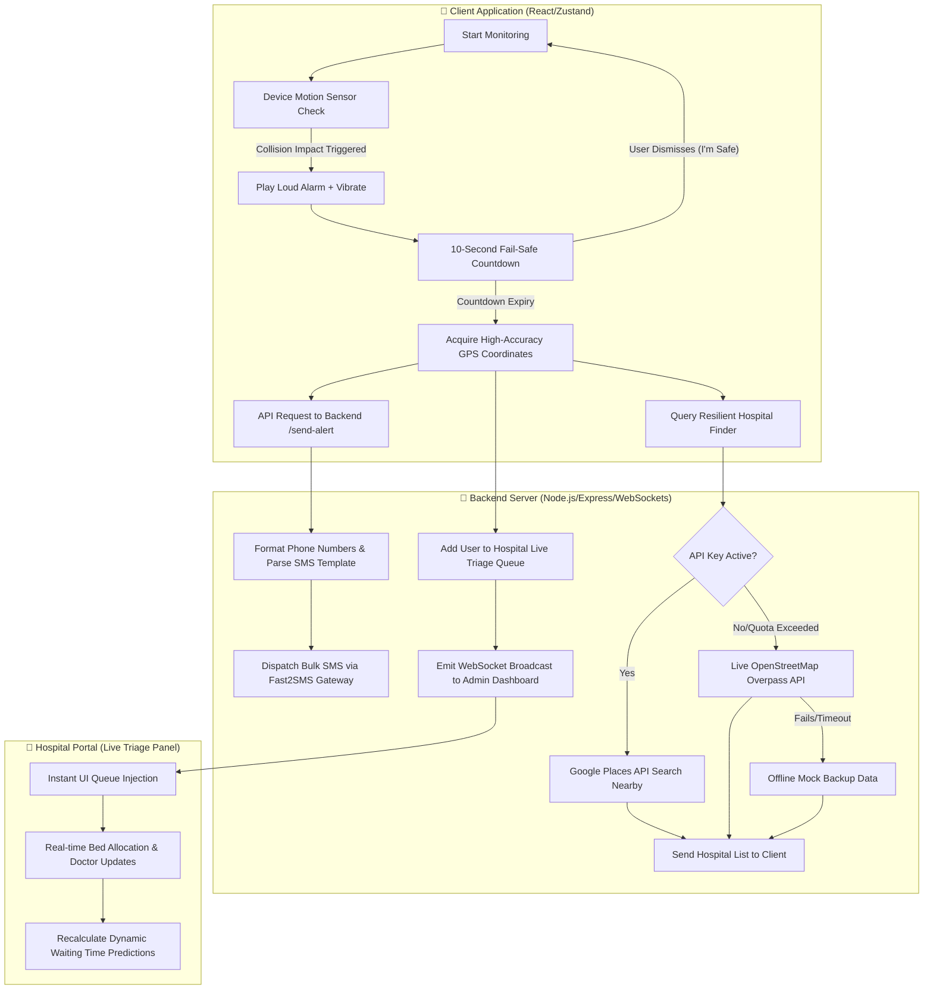

# 🚨 LifeSensorX — Advanced Accident Detection & Smart Emergency Responder

[](https://react.dev)
[](https://www.typescriptlang.org)
[](https://vite.dev)
[](https://tailwindcss.com)
[](https://nodejs.org)
[](https://socket.io)

**LifeSensorX** is an enterprise-grade, high-performance web ecosystem designed for **real-time vehicular accident detection, automated high-accuracy dispatching, and dynamic emergency hospital routing**. 

---

## 📺 Live Triage & Emergency Dashboard


---

## 📊 System Flow & Architecture



---

## 🚀 Key Features

* **📱 Device Telematics & Crash Detection**:
  * Utilizes HTML5 **DeviceMotion API** to monitor real-time accelerometer forces ($G$-forces).
  * Auto-triggers on severe collision thresholds.
  * Fail-safe **10-second alarm countdown** to cancel false alerts.

* **📡 Resilient Emergency Alerting**:
  * Auto-dispatches GPS coordinates link to primary contacts using the **Fast2SMS Bulk Gateway**.
  * Dynamic fallback to local protocol links (WhatsApp/SMS pre-populated templates) if internet connectivity or gateway fails.

* **🏥 3-Tier Self-Healing Hospital Finder**:
  * Scans for trauma centers within a **10 KM radius**.
  * **Tier 1 (Google Places API)**: Fetches locations, ratings, and phone numbers.
  * **Tier 2 (OpenStreetMap Overpass API)**: Seamless zero-cost fallback if API limit is reached.
  * **Tier 3 (Mock Coordinates Engine)**: Serves safe mock data during sandbox mode.

* **⚡ Real-time Socket.io Triage Portal**:
  * Live triage queue injection for instant victim registration.
  * Smart wait-time predictions based on patient severity.
  * Dynamic general, emergency, and ICU bed management.

---

## 🛠️ Technology Stack

* **Frontend**: React 19, TypeScript 6, Vite 8, Tailwind CSS 4, Recharts, Zustand
* **Backend**: Node.js, Express, Socket.io (WebSockets)
* **APIs**: Google Places API, OpenStreetMap Overpass API, Fast2SMS API

---

## ⚙️ Quick Start & Setup

### 1. Environment Configuration
Create a `.env` file inside the `server/` directory:
```env
PORT=5000
FAST2SMS_API_KEY=your_fast2sms_key
GOOGLE_MAPS_API_KEY=your_google_key
```

### 2. Run Backend Server
```bash
cd server
npm install
node index.js
```

### 3. Run Frontend App
```bash
# From root directory
npm install
npm run dev
```

---

## 📱 Mobile Testing
1. Connect computer and smartphone to the same Wi-Fi.
2. Open the custom HTTPS Network address displayed by Vite (e.g. `https://192.168.x.x:5173`).
3. Grant accelerometer and location permissions, then test the crash alert by shaking the device!

---

Developed with ❤️ by [Sittu](https://github.com/its-Sittu)
