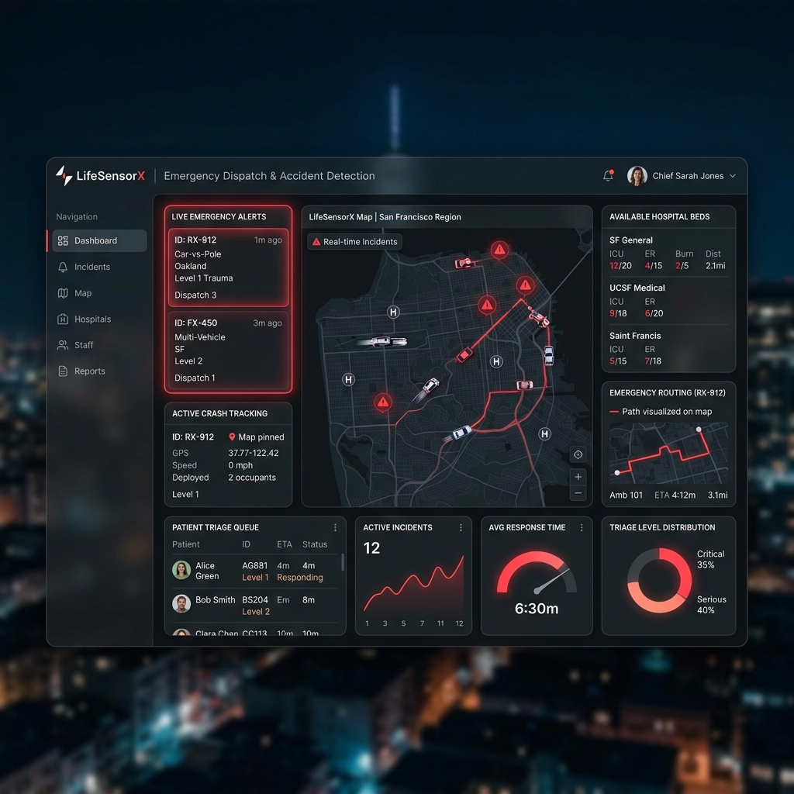
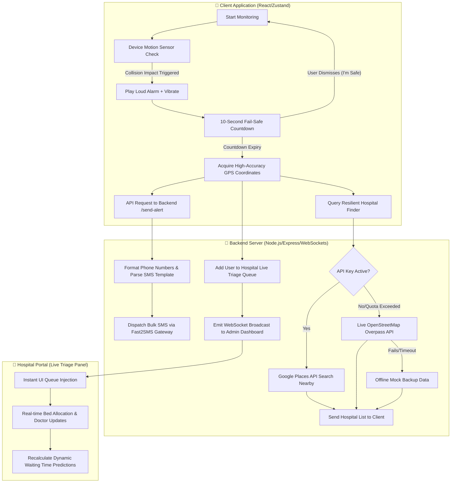

# 🚨 LifeSensorX — Advanced Accident Detection & Smart Emergency Responder

[](https://react.dev)
[](https://www.typescriptlang.org)
[](https://vite.dev)
[](https://tailwindcss.com)
[](https://nodejs.org)
[](https://socket.io)

**LifeSensorX** is an enterprise-grade, high-performance web ecosystem designed for **real-time vehicular accident detection, automated high-accuracy emergency alerting, and dynamic smart hospital triage queue routing**. 

When a crash is detected by mobile device telematics, the application immediately initiates a high-intensity audio-visual warning. If the user is incapacitated and the countdown expires, LifeSensorX automatically acquires high-accuracy GPS coordinates, dispatches SMS alerts containing a Google Maps link to pre-configured emergency contacts, registers the victim in the hospital's live triage queue, and routes them to the nearest available medical facility.

---

## 📺 Live Application Preview



---

## 📊 Complete System Flow & Technical Architecture

The following diagram outlines the complete end-to-end telemetry pipeline, alerting protocol, and real-time backend synchronization flows:



---

## 🚀 Key System Features (In-Depth Explanation)

### 1. 📱 Device Telematics & Intelligent Crash Detection
* **High-Frequency $G$-Force Monitoring**: Leverages the HTML5 **DeviceMotion API** to sample real-time device accelerometer changes. It dynamically listens for severe impact forces (extreme velocity changes) representing a vehicular collision.
* **10-Second Alarm Countdown**: To eliminate false alerts (e.g. dropping the phone), a high-intensity red modal is presented alongside a loud looping alarm siren and rhythmic vibration pulses. 
* **User Override Hook**: The user can dismiss the emergency state instantly by tapping **"I'M SAFE"**, which immediately stops the alarm, restores device sensor listening, and prevents emergency contact alerting.

### 2. 📡 Resilient Multi-Channel Emergency Alerting
* **Automated Background SMS**: If the fail-safe timer runs out, the client instantly fetches high-accuracy GPS coordinates and POSTs to the server, which formats the message and dispatches a background alert SMS via the **Fast2SMS Bulk Gateway** to all registered contacts.
* **Smart Client Fallbacks**: If the server API is offline or if emergency contacts are unconfigured, the app falls back to opening native client protocols:
  * **WhatsApp Integration**: Creates pre-filled location templates using the custom `whatsapp://send` URI scheme to bypass manual typing and send coordinates instantly.
  * **Native SMS App Launcher**: Aggregates all contact phone numbers in a comma-separated list to auto-populate the system's native SMS application with the ready-to-send maps link.

### 3. 🏥 Resilient 3-Tier Hospital Locator Engine
* **10 KM Scan Boundary**: Scans the coordinates' radius to compile a list of trauma facilities.
* **Tier 1 (Google Places API - New & Classic)**: The server queries Google's latest text/nearby search indices to retrieve the top 5 medical centers, acquiring detailed metadata like international telephone numbers, ratings, and exact directions.
* **Tier 2 (OpenStreetMap Overpass API Fallback)**: If Google Places API credentials are not provided or the quota is exhausted, the server seamlessly performs a direct HTTP query to OpenStreetMap Overpass API nodes. This requires no API keys and yields real local coordinates.
* **Tier 3 (Mock Sandboxing Data)**: Used for isolated offline testing to guarantee that the application never breaks.
* **Haversine Distance Computing**: On receiving the hospital list, the client calculates the precise line-of-sight distance using the Haversine formula:
  $$d = 2R \arcsin\left(\sqrt{\sin^2\left(\frac{\Delta \phi}{2}\right) + \cos(\phi_1)\cos(\phi_2)\sin^2\left(\frac{\Delta \lambda}{2}\right)}\right)$$
* **Actionable Routing & Dialing**: Users can tap **"Call Now"** to execute a native phone hook (`tel:...`) or **"Directions"** to launch Google Maps navigation directly to the hospital entrance.

### 4. ⚡ Real-Time WebSocket Hospital Dashboard & Patient Triage Queue
* **Instant Triage Registration**: On crash detection, the backend automatically posts a new patient record into the live triage queue (`/api/queue`) with a status of `WAITING` and `severity: "CRITICAL"`.
* **Socket.io Sync Engine**: Broadcasts live updates (`queueUpdate` and `hospitalUpdate` events) to all connected clients and the admin hospital dashboard. This allows trauma wards to view incoming crash victims instantly as they are being transported.
* **Smart Wait-Time Prediction Algorithm**: Calculates estimated wait times in minutes for every incoming patient dynamically using the following criteria:
  * Base consultation time per patient is set to **15 minutes**.
  * Patients are weighted by medical urgency: `CRITICAL: 4`, `HIGH: 3`, `MEDIUM: 2`, `LOW: 1`.
  * The system computes patient position ahead of the current record based on FCFS (First Come, First Served) and severity levels, scaling it by available doctors:
    $$\text{Wait Time} = \lceil \frac{\text{Patients Ahead} \times 15}{\text{Available Doctors}} \rceil$$

### 5. 🛏️ Hospital Resource Manager
* **Bed Ward Tracking**: Keeps a real-time count of total, occupied, and available beds across General, Emergency, and ICU wards.
* **Live Allocation Controls**: Allows hospital administration staff to allocate or free bed resources on the fly, immediately broadcasting the modified numbers to the emergency client interface.

---

## 🔌 API Reference & Documentation

### 1. Send Emergency SMS
* **Endpoint**: `POST /send-alert`
* **Content-Type**: `application/json`
* **Request Payload**:
  ```json
  {
    "contacts": ["+919876543210"],
    "latitude": 28.6139,
    "longitude": 77.2090
  }
  ```
* **Response (Success)**:
  ```json
  {
    "success": true,
    "message": "Emergency SMS sent successfully",
    "request_id": "req_8372648"
  }
  ```

### 2. Fetch Nearby Hospitals
* **Endpoint**: `GET /nearby-hospitals`
* **Query Parameters**: `lat` (latitude), `lng` (longitude), `query` (optional manual text search)
* **Response (Success - Google Places Fallback)**:
  ```json
  {
    "success": true,
    "source": "google_new",
    "results": [
      {
        "name": "Max Super Speciality Hospital, Saket",
        "address": "1 2, Press Enclave Marg, Saket, New Delhi",
        "location": { "lat": 28.5275, "lng": 77.2119 },
        "phone": "+91 11 2651 5050"
      }
    ]
  }
  ```

### 3. Retrieve Live Hospital Statuses
* **Endpoint**: `GET /api/hospitals`
* **Response (Success)**:
  ```json
  {
    "success": true,
    "data": [
      {
        "_id": "hosp_1",
        "name": "Central General Hospital",
        "beds": {
          "total": 100, "occupied": 50, "available": 50,
          "icu": { "total": 20, "occupied": 15, "available": 5 },
          "emergency": { "total": 10, "occupied": 8, "available": 2 }
        },
        "doctorsAvailable": 5,
        "emergencySupport": true
      }
    ]
  }
  ```

### 4. Update Bed Ward Counts
* **Endpoint**: `PUT /api/hospitals/:id/beds`
* **Request Payload**:
  ```json
  {
    "type": "icu",
    "action": "allocate"
  }
  ```
* **Response (Success)**:
  ```json
  {
    "success": true,
    "data": {
      "total": 100, "occupied": 51, "available": 49,
      "icu": { "total": 20, "occupied": 16, "available": 4 },
      "emergency": { "total": 10, "occupied": 8, "available": 2 }
    }
  }
  ```

### 5. Add Patient to Triage Queue
* **Endpoint**: `POST /api/queue`
* **Request Payload**:
  ```json
  {
    "name": "Jane Doe",
    "severity": "CRITICAL",
    "consultationType": "TRAUMA"
  }
  ```
* **Response (Success)**:
  ```json
  {
    "success": true,
    "data": {
      "_id": "pat_1780046160000",
      "name": "Jane Doe",
      "severity": "CRITICAL",
      "status": "WAITING",
      "consultationType": "TRAUMA",
      "arrivalTime": "2026-05-29T09:17:30.000Z",
      "estimatedWaitTime": 0
    }
  }
  ```

---

## 🛠️ Technology Stack Detail

* **Frontend Framework**: React 19 (for high-speed declarative state rendering)
* **Type Safety**: TypeScript 6 (enforcing data contracts for maps and triage data structures)
* **Build System & Performance**: Vite 8 (with hot-module reloading and rapid asset pre-bundling)
* **Styling**: Tailwind CSS 4 (custom glassmorphism utilities and responsive dark-mode variables)
* **State Management**: Zustand (lightweight central client store with persistent local storage caching for emergency contacts)
* **Backend Runtime**: Node.js & Express (minimal, high-throughput REST API serving routes and fallback mechanisms)
* **Bi-directional Event Streaming**: Socket.io (WebSocket wrappers for instant patient updates)
* **HTTP Client**: Axios (configured with request limits and timeout catch rules)
* **Icon Assets**: Lucide React

---

## ⚙️ Quick Start & Setup Guide

### Prerequisites
* **Node.js** (v18.x or above)
* **npm** (v9.x or above)

### Step 1: Clone the Repository & Install Root Dependencies
```bash
git clone https://github.com/its-Sittu/LifeSensorX.git
cd LifeSensorX
npm install
```

### Step 2: Configure Environment Variables
Inside the `server/` directory, create a `.env` file:
```bash
cd server
touch .env
```
Populate the configuration variables as follows:
```env
PORT=5000
FAST2SMS_API_KEY=your_fast2sms_api_key_here
GOOGLE_MAPS_API_KEY=your_google_places_api_key_here
```

### Step 3: Launch the Backend Server
```bash
node index.js
```
*Verification output:* `🚀 Emergency Backend running on port 5000`

### Step 4: Launch the Frontend App
Open a separate terminal window at the project root directory and run:
```bash
npm run dev
```
*Verification output:* `➜  Local:   https://localhost:5173/`

---

## 🔒 Privacy & Offline Security Model

* **Sandboxed Storage**: Emergency contacts, local logs, and alert configurations are cached locally inside the client's web browser environment using the persistent **Zustand LocalStorage** middleware. Zero contact lists or location tracking histories are harvested or uploaded to remote databases.
* **Isolated Telemetry**: High-frequency accelerations are processed strictly on-device. No telemetry is transmitted to the server until a crash threshold is crossed and the countdown runs out.

---

## 📱 Real-Time Mobile Device Testing

1. Connect your hosting computer and smartphone to the **same Wi-Fi network**.
2. Identify the custom Vite HTTPS local network address in your console (e.g. `https://192.168.1.15:5173/`).
3. Load the URL on your mobile phone's browser.
4. **Grant permissions** to both the **device motion/accelerometer sensors** and **geolocation coordinates** when prompted.
5. Shake the device vigorously to simulate a collision force, listening for the siren and watching the triage countdown activate!

---

Developed with ❤️ by [Sittu](https://github.com/its-Sittu)
