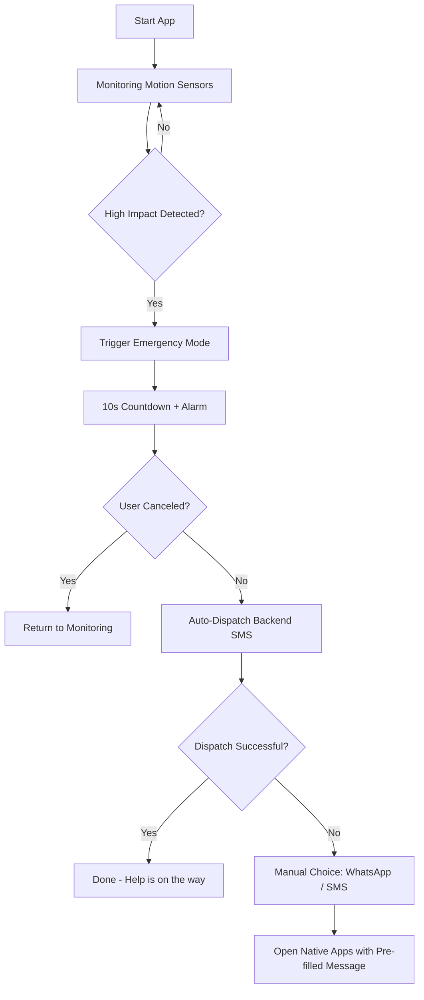

# 🚨 LifeSensorX - Advanced Accident Detection & Emergency Alert System

LifeSensorX is a production-ready web application designed for real-time accident detection and automated emergency alerting. Using high-precision motion sensors and geolocation tracking, it ensures that help is on the way even when you can't call for it.

## 🚀 Key Features

- **Crash Detection:** Real-time monitoring using the Device Motion API to detect high-impact collisions.
- **Smart Countdown:** A 10-second fail-safe timer to prevent false alarms.
- **Auto-Dispatch SMS:** Integrated with Twilio for automated background SMS alerts to emergency contacts.
- **Multi-Channel Fallback:** Native WhatsApp and SMS app integration if the primary server dispatch fails.
- **Live Location Tracking:** Precise GPS coordinates sharing with Google Maps integration.
- **Progressive UI:** Premium, futuristic design with glassmorphism and smooth animations.

---

## 📊 System Workflow



---

## 🛠️ Tech Stack

- **Frontend:** React, Vite, TypeScript, Tailwind CSS, Framer Motion
- **Backend:** Node.js, Express
- **Messaging:** Twilio API
- **Deployment:** Vercel (Frontend), Render/Railway (Backend)

---

## ⚙️ Setup & Installation

### 1. Backend Setup (Twilio)
Navigate to the `server` directory and install dependencies:
```bash
cd server
npm install
```
Create a `.env` file in the `server` folder:
```env
TWILIO_ACCOUNT_SID=your_sid
TWILIO_AUTH_TOKEN=your_token
TWILIO_PHONE_NUMBER=your_twilio_number
PORT=5000
```
Start the server:
```bash
node index.js
```

### 2. Frontend Setup
Navigate to the root directory:
```bash
npm install
npm run dev
```

---

## 🔒 Security & Privacy
- **Local Storage:** Contacts are stored locally on the user's device.
- **Data Protection:** No sensitive data is stored on our servers permanently.
- **Safety First:** The countdown allows users to dismiss minor bumps or false triggers.

## 📱 Mobile Compatibility
For the best experience (including crash detection), access the app via **HTTPS** on your mobile browser.

---
Developed with ❤️ for safety by [Sittu](https://github.com/its-Sittu)
