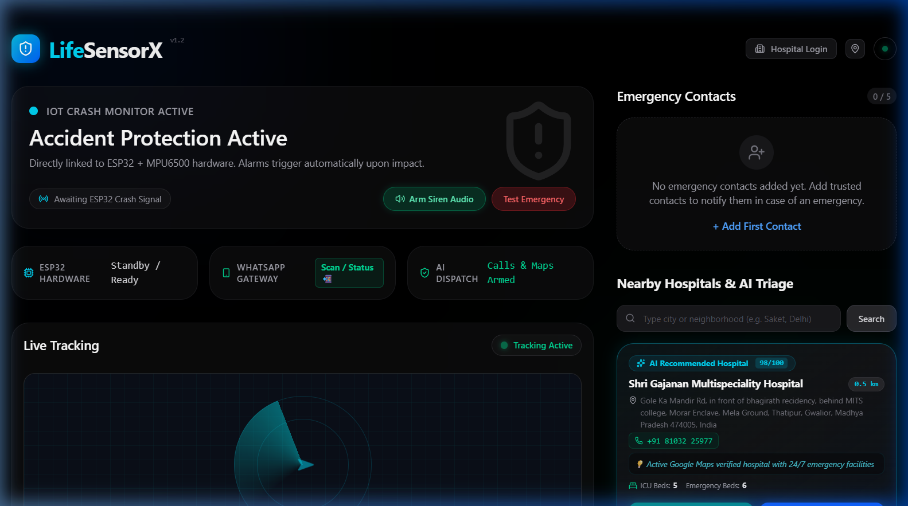
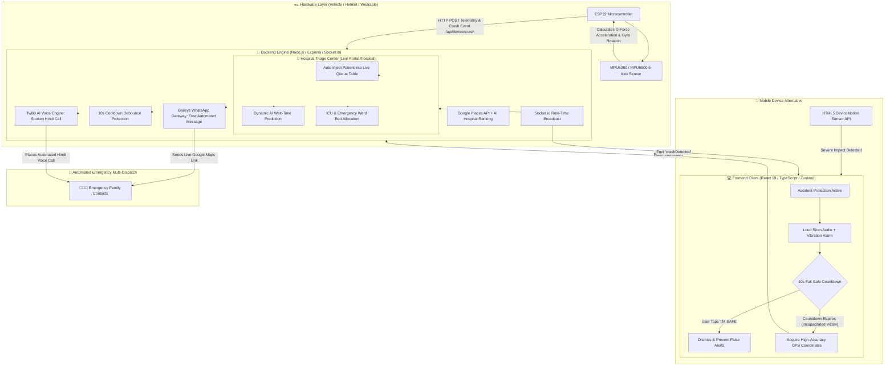

# 🚨 LifeSensorX — IoT Accident Detection & Smart Emergency Responder

[](https://react.dev)
[](https://www.typescriptlang.org)
[](https://vite.dev)
[](https://tailwindcss.com)
[](https://nodejs.org)
[](https://socket.io)
[](https://whatsapp.com)
[](https://twilio.com)

---

## 📖 Executive Summary

**LifeSensorX** is an end-to-end IoT and Cloud-enabled emergency healthcare ecosystem built to detect vehicular crashes in real time, eliminate false alarms with intelligent fail-safes, instantly broadcast live GPS coordinates to family contacts via WhatsApp and AI Voice Calls, and automatically triage the victim into the nearest hospital's trauma ward queue.

---

## 🖥️ Present Website & System UI Showcase

| 🛡️ Accident Protection Dashboard | 🏥 Live Hospital Triage & Bed Management |
| :---: | :---: |
|  | **Hospital Portal (`/hospital`)** with real-time queue & bed tracking |

### 📱 Live System Modules:
1. **User Protection Client (`/`)**: Real-time IoT hardware telemetry status, siren audio arming, emergency contacts manager, and 1-click test triggers.
2. **Emergency Fail-Safe Modal**: 10-second audible & vibrational countdown with a prominent **"I'M SAFE"** cancellation button.
3. **In-App WhatsApp Gateway Scanner**: Interactive QR code modal on the dashboard allowing any user to link their WhatsApp in 5 seconds.
4. **Hospital Admin Portal (`/hospital`)**: Real-time trauma triage queue, AI wait-time calculator, and live ICU/Emergency bed allocation.

---

## 🔄 Complete Hardware-to-Software Architecture


```mermaid
flowchart TD
    subgraph HW ["🏎️ Hardware Layer (Vehicle / Helmet / Wearable)"]
        H1[ESP32 Microcontroller] --> H2[MPU6050 / MPU6500 6-Axis Sensor]
        H2 -->|Calculates G-Force Acceleration & Gyro Rotation| H1
        H1 -->|HTTP POST Telemetry & Crash Event /api/device/crash| BE
    end

    subgraph Mobile ["📱 Mobile Device Alternative"]
        M1[HTML5 DeviceMotion Sensor API] -->|Severe Impact Detected| FE
    end

    subgraph FE ["💻 Frontend Client (React 19 / TypeScript / Zustand)"]
        FE1[Accident Protection Active] --> FE2[Loud Siren Audio + Vibration Alarm]
        FE2 --> FE3{10s Fail-Safe Countdown}
        FE3 -- "User Taps 'I'M SAFE'" --> FE4[Dismiss & Prevent False Alerts]
        FE3 -- "Countdown Expires (Incapacitated Victim)" --> FE5[Acquire High-Accuracy GPS Coordinates]
        FE5 -->|POST /send-alert| BE
    end

    subgraph BE ["📡 Backend Engine (Node.js / Express / Socket.io)"]
        BE --> B1[10s Cooldown Debounce Protection]
        BE --> B2[Socket.io Real-Time Broadcast]
        
        B2 -->|Emit 'crashDetected'| FE
        B2 -->|Emit 'queueUpdate'| HP
        
        BE --> D1[Baileys WhatsApp Gateway: Free Automated Message]
        BE --> D2[Twilio AI Voice Engine: Spoken Hindi Call]
        BE --> D3[Google Places API + AI Hospital Ranking]
    end

    subgraph Dispatch ["📢 Automated Emergency Multi-Dispatch"]
        D1 -->|Sends Live Google Maps Link| R1[👨‍👩‍👦 Emergency Family Contacts]
        D2 -->|Places Automated Hindi Voice Call| R1
    end

    subgraph HP ["🏥 Hospital Triage Center (Live Portal /hospital)"]
        HP --> Q1[Auto-Inject Patient into Live Queue Table]
        HP --> Q2[Dynamic AI Wait-Time Prediction]
        HP --> Q3[ICU & Emergency Ward Bed Allocation]
    end
```

---

## ⚙️ How It Works: Step-by-Step Pipeline

### 1️⃣ Hardware Detection (ESP32 + MPU6050/6500)
- The ESP32 reads 3-axis linear acceleration ($a_x, a_y, a_z$) and angular velocity ($g_x, g_y, g_z$).
- It computes the overall impact magnitude:
  $$\text{Magnitude} = \sqrt{a_x^2 + a_y^2 + a_z^2}$$
- When impact exceeds safety thresholds, ESP32 transmits a JSON payload to `POST /api/device/crash`.
- The server applies a **10-second debounce filter** to prevent duplicate alert storms.

### 2️⃣ 10-Second Fail-Safe Countdown
- Upon receiving the crash signal, the frontend triggers a high-intensity red screen, loud looping audio siren via Web Audio API, and rhythmic vibration.
- If it was an accidental drop, the user taps **"I'M SAFE"** within 10 seconds to stop all actions.

### 3️⃣ Automated Multi-Channel Emergency Dispatch
If the countdown expires (victim incapacitated):
- **High-Accuracy GPS Fetch**: Coordinates are acquired via HTML5 Geolocation API (`enableHighAccuracy: true`).
- **100% Free Automated WhatsApp Dispatch**: Server sends an automatic WhatsApp alert with a clickable Google Maps link (`https://maps.google.com/?q=lat,lng`) using the integrated **Baileys Web Gateway**.
- **Twilio AI Voice Call**: Twilio places an automated phone call to registered contacts, speaking in Hindi:
  > *"सावधान! यह लाइफ सेंसर एक्स से एक आपातकालीन संदेश है। मरीज का गंभीर एक्सीडेंट डिटेक्ट हुआ है..."*

### 4️⃣ Smart Hospital Discovery & AI Queue Triage
- **3-Tier Locator Engine**: Queries Google Places API $\to$ OpenStreetMap Overpass $\to$ Haversine Distance computation to find top trauma centers within 10 km.
- **Instant Patient Admission**: The backend registers the victim in the hospital's live triage database (`/api/queue`) with `severity: "CRITICAL"`.
- **Dynamic AI Wait-Time Formula**:
  $$\text{Estimated Wait Time} = \left\lceil \frac{\text{Weighted Patients Ahead} \times 15}{\text{Available Doctors}} \right\rceil$$

---

## 🛠️ Technology Stack Breakdown

| Layer | Component | Details |
| :--- | :--- | :--- |
| **Hardware** | Microcontroller & Sensors | ESP32, MPU6050, MPU6500 (I2C Protocol, JSON Telemetry) |
| **Frontend** | Framework & UI | React 19, TypeScript, Vite, Tailwind CSS, Framer Motion, Lucide Icons |
| **State** | Client Store | Zustand with persistent `LocalStorage` synchronization |
| **Backend** | Server Engine | Node.js, Express.js, Socket.io (WebSocket Streaming) |
| **WhatsApp** | Automation Gateway | `@whiskeysockets/baileys` (Multi-Device WebSocket Engine), `qrcode` |
| **Voice & SMS** | Telephony APIs | Twilio Voice (TwiML Polly.Aditi), Fast2SMS Bulk Gateway |
| **Geocoding** | Maps & Routing | Google Places API (New & Classic), Google Maps Directions, OpenStreetMap |

---

## 🚀 Quick Start & Installation

### Prerequisites
- **Node.js** (v18.x or above)
- **npm** (v9.x or above)
- **Git**

---

### Step 1: Clone Repository & Install Dependencies
```bash
# Clone repository
git clone https://github.com/its-Sittu/LifeSensorX.git
cd LifeSensorX

# Install client dependencies
npm install

# Install server dependencies
cd server
npm install
cd ..
```

---

### Step 2: Configure Environment Variables
Inside the `server/` directory, create a `.env` file:
```env
PORT=5000
NODE_ENV=production

# Twilio AI Voice Credentials
TWILIO_ACCOUNT_SID=your_twilio_account_sid
TWILIO_AUTH_TOKEN=your_twilio_auth_token
TWILIO_PHONE_NUMBER=your_twilio_phone_number
TWILIO_WHATSAPP_NUMBER=whatsapp:+17372508034

# SMS & Maps API Keys
FAST2SMS_API_KEY=your_fast2sms_api_key_here
GOOGLE_MAPS_API_KEY=your_google_maps_api_key_here
```

---

### Step 3: Run the Application

**1. Start the Backend Server:**
```bash
cd server
node index.js
```
*Console output:*
`🚀 Emergency Backend running on port 5000`  
`📲 [WhatsApp Gateway] Starting Baileys...`

**2. Start the Frontend Client (in a separate terminal):**
```bash
npm run dev
```
*Console output:*
`➜ Local: http://localhost:5173/`

---

## 📲 WhatsApp Gateway Setup in 5 Seconds

1. Open **LifeSensorX Dashboard** (`http://localhost:5173`) and click **`📲 WhatsApp Gateway (Scan / Status)`** (or visit `http://localhost:5000/api/whatsapp/qr`).
2. Open **WhatsApp** on your mobile phone $\to$ **Menu (⋮)** $\to$ **Linked Devices** $\to$ **Link a Device**.
3. Scan the on-screen QR Code.
4. **Done!** The status will display **`CONNECTED & READY`**. All future emergency alerts will dispatch automatically from your linked WhatsApp!

---

## 📡 API Reference & Endpoints

### 1. Emergency Alert Dispatch
- **Endpoint:** `POST /send-alert`
- **Request Body:**
  ```json
  {
    "contacts": ["+918789812990"],
    "latitude": 28.6139,
    "longitude": 77.2090
  }
  ```
- **Action:** Dispatches automated WhatsApp message with Google Maps link, executes Twilio AI Voice Call, and alerts hospital queue.

### 2. ESP32 Hardware Crash Telemetry
- **Endpoint:** `POST /api/device/crash`
- **Request Body:**
  ```json
  {
    "deviceId": "ESP32_HELMET_01",
    "ax": 5.21, "ay": 1.14, "az": 9.81,
    "gx": 2.1, "gy": 0.8, "gz": 0.3,
    "crashDetected": true,
    "magnitude": 11.2
  }
  ```

### 3. WhatsApp Gateway Control
- `GET /api/whatsapp/qr`: Interactive in-browser QR Code dashboard
- `GET /api/whatsapp/status`: Returns `{ isConnected, connectedUser, hasQr }`
- `GET /api/whatsapp/test?phone=8789812990`: Sends test emergency alert
- `ALL /api/whatsapp/logout`: Disconnects session and generates fresh QR code

---

## 🛡️ Fail-Safe Protection & Privacy

- **Zero False Alarms**: The 10-second fail-safe countdown prevents accidental alerts when a phone or helmet is dropped.
- **Private & Sandboxed**: Emergency contacts are saved locally on the client device using persistent Zustand LocalStorage.
- **Multi-Gateway Redundancy**: If one channel is unavailable, LifeSensorX concurrently engages WhatsApp Web, Twilio Voice Calling, and native mobile SMS protocols.

---

## 👨‍💻 Author & Acknowledgements

Developed with ❤️ by **[Sittu Kumar Singh](https://github.com/its-Sittu)**  
*LifeSensorX — Saving Lives Through Smart IoT Telematics & Rapid Emergency Response.*
