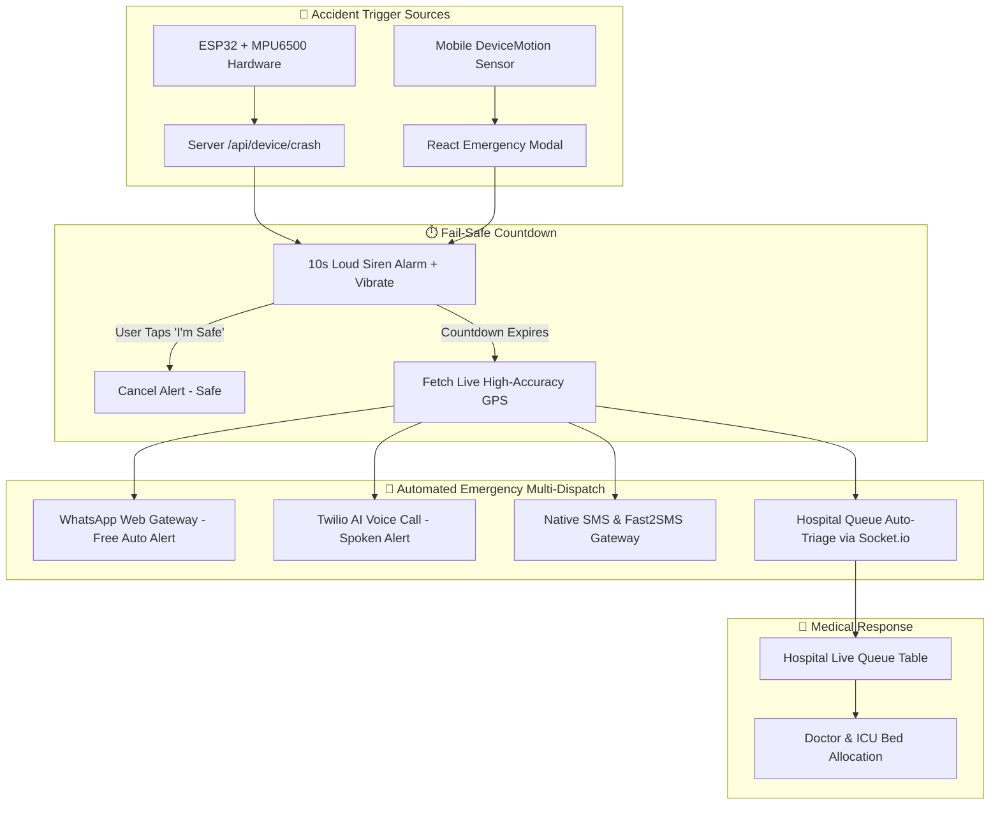

# 🚨 LifeSensorX — Smart Accident Detection & Emergency Dispatch Ecosystem

[](https://react.dev)
[](https://www.typescriptlang.org)
[](https://vite.dev)
[](https://tailwindcss.com)
[](https://nodejs.org)
[](https://whatsapp.com)
[](https://twilio.com)

---

## 📖 Overview

**LifeSensorX** is an enterprise-grade IoT & Web-based **Smart Emergency Accident Detection and Instant Dispatch System**. 

When a crash or high-impact collision is detected (via **ESP32 + MPU6050/6500 IoT Hardware** or **Smartphone Accelerometer Telematics**), LifeSensorX immediately triggers a high-intensity audio-visual siren countdown. If the user does not dismiss the alarm within 10 seconds (fail-safe protection for incapacitated victims), the system automatically:

1. 📍 **Acquires High-Accuracy Live GPS Coordinates** and builds a Google Maps location link.
2. 📲 **Dispatches Automated WhatsApp Emergency Alerts** directly to all registered family/emergency contacts with real-time location.
3. 📞 **Places Automated AI Voice Calls (Hindi/English)** to family contacts speaking out the emergency alert and GPS status.
4. 🏥 **Searches & AI-Ranks Nearest Hospitals** within a 10 km radius and auto-injects the victim into the Hospital Triage Queue.

---

## ✨ Key Features

### 1. 🤖 Multi-Device Crash Detection Engine
- **ESP32 IoT Hardware Telematics**: Receives real-time acceleration ($g$-force) and gyroscope data via `POST /api/device/crash`.
- **Mobile Sensor Telematics**: HTML5 `DeviceMotion` accelerometer monitoring directly on mobile browsers.
- **10-Second Fail-Safe Countdown**: High-intensity siren + vibration fail-safe. If the user is safe, tapping **"I'M SAFE"** cancels all alerts instantly.

### 2. 📲 100% Free Automated WhatsApp Emergency Dispatch
- Built-in **WhatsApp Web Automation Gateway** powered by `@whiskeysockets/baileys`.
- **Zero Cost, Unlimited Messages**: Dispatches directly from your linked WhatsApp to any phone number without sandbox codes or per-message charges.
- **In-App QR Dashboard**: Built-in QR scanner modal in the dashboard to link in 5 seconds (`/api/whatsapp/qr`).

### 3. 📞 Twilio AI Emergency Voice Calling
- Places real-time automated emergency phone calls to family contacts.
- Speaks natural voice alert: *"सावधान! यह लाइफ सेंसर एक्स से एक आपातकालीन संदेश है। मरीज का एक्सीडेंट डिटेक्ट हुआ है..."*

### 4. 🏥 Smart Hospital Locator & Live Triage Queue
- **Google Places API + AI Ranking**: Discovers nearest emergency centers, calculates travel distance, bed counts, and ratings.
- **Real-Time WebSockets (`Socket.io`)**: Broadcasts incoming crash alerts live to hospital trauma wards.
- **AI Wait-Time Prediction**: Dynamically calculates patient queue wait time based on medical urgency and available doctors.

---

## 🏗️ System Architecture & Workflow


```mermaid
flowchart TD
    subgraph Trigger ["🚨 Accident Trigger Sources"]
        A1[ESP32 + MPU6500 Hardware] --> B[Server /api/device/crash]
        A2[Mobile DeviceMotion Sensor] --> C[React Emergency Modal]
    end

    subgraph Alarm ["⏱️ Fail-Safe Countdown"]
        B & C --> D[10s Loud Siren Alarm + Vibrate]
        D -- "User Taps 'I'm Safe'" --> E[Cancel Alert - Safe]
        D -- "Countdown Expires" --> F[Fetch Live High-Accuracy GPS]
    end

    subgraph Dispatch ["📡 Automated Emergency Multi-Dispatch"]
        F --> G[WhatsApp Web Gateway - Free Auto Alert]
        F --> H[Twilio AI Voice Call - Spoken Alert]
        F --> I[Native SMS & Fast2SMS Gateway]
        F --> J[Hospital Queue Auto-Triage via Socket.io]
    end

    subgraph Hospital ["🏥 Medical Response"]
        J --> K[Hospital Live Queue Table]
        K --> L[Doctor & ICU Bed Allocation]
    end
```

---

## 🛠️ Technology Stack

| Layer | Technology |
| :--- | :--- |
| **Frontend** | React 19, TypeScript, Vite, Tailwind CSS, Framer Motion, Lucide Icons |
| **State Management** | Zustand (with persistent LocalStorage middleware) |
| **Backend** | Node.js, Express.js, Socket.io (WebSocket Streaming) |
| **WhatsApp Engine** | `@whiskeysockets/baileys` (Multi-Device WebSocket Client), QRCode |
| **Telephony / Voice** | Twilio Voice & TwiML Polly Voice Engine |
| **Maps & Hospital Geocoding** | Google Places API, Google Maps Directions, OpenStreetMap |
| **Hardware / IoT** | ESP32, MPU6050 / MPU6500 6-Axis Accelerometer & Gyroscope |

---

## 🚀 Quick Start & Installation

### Prerequisites
- **Node.js** (v18.x or above)
- **npm** (v9.x or above)
- **Git**

---

### Step 1: Clone the Repository
```bash
git clone https://github.com/its-Sittu/LifeSensorX.git
cd LifeSensorX
```

### Step 2: Install Dependencies
```bash
# Install frontend dependencies
npm install

# Install backend dependencies
cd server
npm install
cd ..
```

---

### Step 3: Configure Environment Variables
Inside the `server/` directory, create a `.env` file:
```env
PORT=5000
NODE_ENV=production

# Twilio Voice & Telephony
TWILIO_ACCOUNT_SID=your_twilio_account_sid
TWILIO_AUTH_TOKEN=your_twilio_auth_token
TWILIO_PHONE_NUMBER=your_twilio_phone_number
TWILIO_WHATSAPP_NUMBER=whatsapp:+17372508034

# SMS & Maps API
FAST2SMS_API_KEY=your_fast2sms_api_key_here
GOOGLE_MAPS_API_KEY=your_google_maps_api_key_here
```

---

### Step 4: Run the Project Locally

**1. Start the Backend Server:**
```bash
cd server
node index.js
```
*Output: `🚀 Emergency Backend running on port 5000`*

**2. Start the Frontend Application (in a new terminal):**
```bash
npm run dev
```
*Output: `➜ Local: http://localhost:5173/`*

---

## 📲 WhatsApp Gateway Setup (5 Seconds)

1. Open `http://localhost:5000/api/whatsapp/qr` (or click **"WhatsApp Gateway"** on the Dashboard).
2. Open **WhatsApp** on your phone > **Menu (⋮)** > **Linked Devices** > **Link a Device**.
3. Scan the on-screen **QR Code**.
4. Once connected, your WhatsApp account will automatically send emergency location alerts whenever a crash occurs!

---

## 📡 API Endpoints Reference

### 1. Trigger Emergency Dispatch
- **Endpoint:** `POST /send-alert`
- **Body:**
  ```json
  {
    "contacts": ["+918789812990"],
    "latitude": 28.6139,
    "longitude": 77.2090
  }
  ```
- **Response:** Dispatches WhatsApp message, Twilio Voice Call, and live GPS Maps link.

### 2. ESP32 IoT Crash Signal
- **Endpoint:** `POST /api/device/crash`
- **Body:**
  ```json
  {
    "deviceId": "ESP32_HELMET_01",
    "ax": 4.82, "ay": 0.12, "az": 9.81,
    "gx": 1.2, "gy": 0.4, "gz": 0.1,
    "crashDetected": true
  }
  ```

### 3. WhatsApp Gateway Status & QR
- `GET /api/whatsapp/qr`: Interactive QR Scanner & Linking UI
- `GET /api/whatsapp/status`: JSON gateway connection state
- `GET /api/whatsapp/test?phone=918789812990`: Send instant test WhatsApp alert
- `ALL /api/whatsapp/logout`: Disconnect & reset session

---

## 🛡️ Privacy & Reliability Fail-Safes

- **No False Alarms**: 10-second audible & vibrational countdown allows false impacts (like dropping the phone) to be cancelled in 1 tap.
- **Offline Resilient**: Local storage caching ensures emergency contacts and cached hospital locations remain accessible even in low connectivity.
- **Multi-Route Fallback**: If one notification channel fails, the system executes Voice Calls, WhatsApp, and Native SMS concurrently to guarantee delivery.

---

## 👨‍💻 Author

Developed with ❤️ by **[Sittu Kumar Singh](https://github.com/its-Sittu)**  
*LifeSensorX — Saving Lives Through Intelligent Automation & Rapid Response.*
